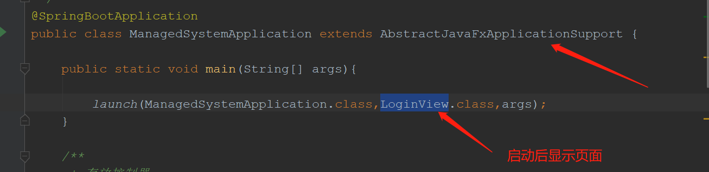
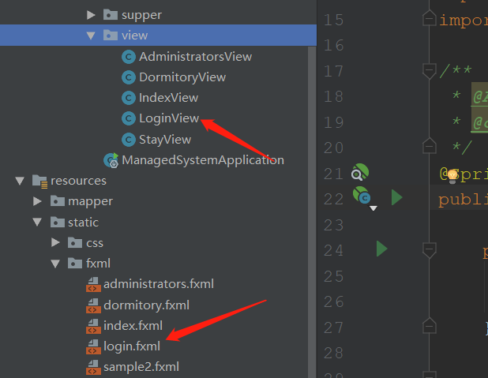

# SpringBoot2.3.1.RELEASE与javaFx整合

### 加入maven依赖

```xml &lt;dependency&gt;
 <dependency>
     <groupId>de.roskenet</groupId>
     <artifactId>springboot-javafx-support</artifactId>
     <version>2.1.6</version>
</dependency>
```

### 启动类继承AbstractJavaFxApplicationSupport



### 采用mvc模式

- 每个fxml页面都有对应的java视图类



- 视图类需继承**AbstractFxmlView**且有**@FXMLView注解**（value值为对应的fxml文件路径）

.jpg)

- fxml文件中需指定对应controller类

.jpg)

- controller类需实现**Initializable**接口并加上**@FXMLController**注解(属性上有FXML注解的会根据属性名与fxml中的fx:id值对应的组件绑定，方便获取值等信息)

.jpg)

.jpg)

- fxml中的绑定事件名前面需加个#，即可绑定对应controller的同名方法

.jpg)

.jpg)

### 示例页面效果展示(只是简单项目，页面可能有点丑)

- 登陆页面

.jpg)

- 主页面

.jpg)

- 点击住宿按钮弹出住宿页面进行信息登记

.jpg)

- 双击对应表格中的宿舍即可查看详情

.jpg)

- 宿舍管理页面

.jpg)

### 获取项目

- [Git仓库地址](https://github.com/czmDeRepository/javaFx)

- **注：运行项目前先在数据库建表,可直接执行sql文件：management_system.sql**

### END